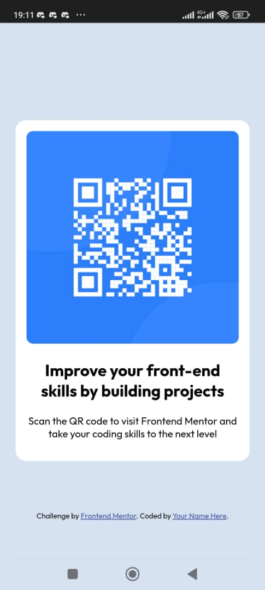
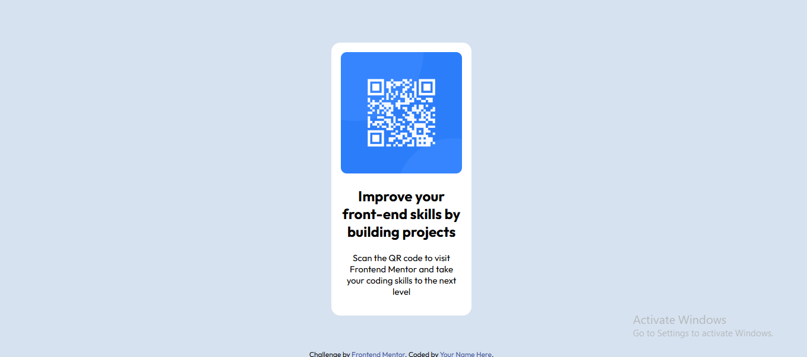

# Frontend Mentor - QR code component solution

This is a solution to the [QR code component challenge on Frontend Mentor](https://www.frontendmentor.io/challenges/qr-code-component-iux_sIO_H). Frontend Mentor challenges help you improve your coding skills by building realistic projects. 

## Table of contents

- [Frontend Mentor - QR code component solution](#frontend-mentor---qr-code-component-solution)
  - [Table of contents](#table-of-contents)
    - [Screenshot](#screenshot)
    - [Links](#links)
    - [Built with](#built-with)
    - [What I learned](#what-i-learned)
    - [Useful resources](#useful-resources)
  - [Author](#author)


### Screenshot





### Links

- Solution URL: (https://github.com/Ajibose/qr-code-component-main)
- Live Site URL: (https://qr-code-component-main-six-inky.vercel.app/)


### Built with

- Semantic HTML5 markup
- CSS custom properties
- Flexbox
- Mobile-first workflow
- [Styled Components](https://styled-components.com/) - For styles

**Note: These are just examples. Delete this note and replace the list above with your own choices**

### What I learned

Use this section to recap over some of your major learnings while working through this project. Writing these out and providing code samples of areas you want to highlight is a great way to reinforce your own knowledge.

To see how you can add code snippets, see below:

```html

```
```css
.main-container {
    border-radius: 15px;
    padding: 1rem;
    background-color: hsl(0, 0%, 100%);
    text-align: center;
    width: 80%;
}

.qr-container img {
    width: 100%;
    display: inline-block;
    height: auto;
    border-radius: 10px;
}

@media screen and (min-width: 768px) {}
```

### Useful resources

- [HTML Images][(https://www.example.com](https://web.dev/learn/html/images?continue=https%3A%2F%2Fweb.dev%2Flearn%2Fhtml%2F%23article-https%3A%2F%2Fweb.dev%2Flearn%2Fhtml%2Fimages)) - This helped me for XYZ reason. I really liked this pattern and will use it going forward.

## Author

- Website - [Ajibose](https://www.your-site.com)
- Frontend Mentor - [@Ajibose](https://www.frontendmentor.io/profile/Ajibose)
- Twitter - [@IbrahimOyebami](https://www.twitter.com/IbrahimOyebami)

